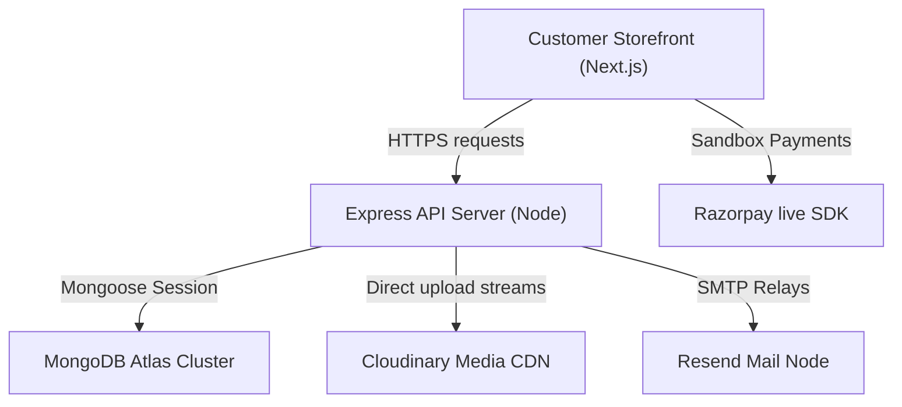

# LUNORA Premium E-Commerce Platform


LUNORA is a production-ready, highly secure, premium e-commerce storefront and API backend. It is designed to serve luxury bags and accessories with state-of-the-art concurrency controls, distributed database caching capabilities, Cloudinary CDN integrations, and automated email relays.

---

## 🎨 Project Screenshots (Placeholders)
- **Storefront Home**: ``
- **Product Gallery**: ``

---

## ✨ Key Features

- **Storefront UI**: Fully responsive editorial UI featuring gold and dark glassmorphism styling, loading shimmers, animated toast lists, and interactive checkout forms.
- **Stock Integrity (Double-Spend Protection)**: Uses atomic Mongoose check-and-decrements filtering on stock levels to prevent race condition oversells under high-traffic flash sales.
- **CSRF Defense**: Double-submit cookie check patterns shield all state-changing HTTP requests.
- **Direct Buffers Streaming CDN**: Integrates with Cloudinary to stream file uploads directly from memory buffers—never caching binaries locally.
- **Dynamic Image Virtuals**: Automatically virtualization renders resized URLs for `thumbnail`, `medium`, and `large` viewport resolutions on product listings.
- **Failsafe Mail Service**: Rotating Nodemailer email manager generating luxury HTML emails with PDF invoice attachments.
- **Admin logging dashboard**: Live email logs variable inspector and retry triggers.
- **Multi-tier Probes**: Comprehensive `/api/health`, `/api/ready` deep validation, and `/api/version` operational checkpoints.

---

## 🛠️ Tech Stack

- **Frontend storefront**: Next.js 16 (App Router, Turbopack, Framer Motion)
- **API Backend**: Express.js, TypeScript, Node.js
- **Database**: MongoDB Atlas, Mongoose ODM
- **Media CDN**: Cloudinary
- **Email Gateway**: Nodemailer (SMTP/Resend relays)
- **Payment Processor**: Razorpay Live SDK
- **Containerization**: Docker, Docker Compose

---

## 🗺️ System Architecture



---

## 📁 Workspace Folder Structure

```
lunora/
├── app/                  # Next.js Storefront App Router pages
├── components/           # UI elements (shimmers, layouts, galleries)
├── context/              # Context Providers (Authing, Cart, Wishlist, Toasts)
├── docs/                 # Reference manuals (Architecture, Database, API Flow)
├── server/               # Backend API Engine
│   ├── src/
│   │   ├── config/       # CDN, SMTP, Database, Logger config
│   │   ├── controllers/  # Route logic handlers
│   │   ├── middlewares/  # CSRF, auth, error limiters
│   │   ├── models/       # Mongoose schema models
│   │   ├── routes/       # Express route routing files
│   │   └── services/     # Order, cart, payment services logic
│   └── tsconfig.json     # Compiler rules
└── scratch/              # Automated test integration scripts
```

---

## ⚙️ Operational Setup

### Installation
```bash
# Root directory dependencies
npm install

# Backend dependencies
cd server
npm install
```

### Seeding the Catalog
```bash
cd server
npx tsx src/scripts/seed.ts
```

### Running Local Development
```bash
# Run from the root directory to launch frontend + backend concurrently
npm run dev
```

---

## 🐳 Docker Container Orchestration

Run LUNORA inside secure container blocks with local MongoDB volumes:
```bash
# Build and run containers
docker compose up --build

# Run database seeder container manually
docker compose run backend node dist/scripts/seed.js
```

---

## 🔒 Environment Variable Specifications

See [`ENVIRONMENT.md`](ENVIRONMENT.md) for full descriptions of all variables.

### Admin Credentials (Local Development)
- **Default Email**: `admin@lunora.com`
- **Default Password**: `AdminPassword123`

---

## 🧪 Verification & Test Suites

Verify all checkout states, concurrency blocks, payments, and CDN uploads:
```bash
# Total Shopping Workflow check
node scratch/test_shopping.js

# Concurrency Checkout Lock check
$env:NODE_PATH="server/node_modules"; node scratch/test_concurrency.js

# CSRF Protection checks
node scratch/test_csrf.js

# Payments Signature checks
node scratch/test_payments.js

# Direct Cloudinary Uploads check
$env:NODE_PATH="server/node_modules"; node scratch/test_uploads.js

# Email SMTP and Invoices check
cd server && node test_email.cjs
```

---

## 📍 Product Release Roadmap

See [`ROADMAP.md`](ROADMAP.md) for full short-term and medium-term planning maps.

---

## 📄 License & Contact
LUNORA is licensed under the [MIT License](LICENSE).
- **Author**: LUNORA Atelier Support Team (`support@lunora.com`)
