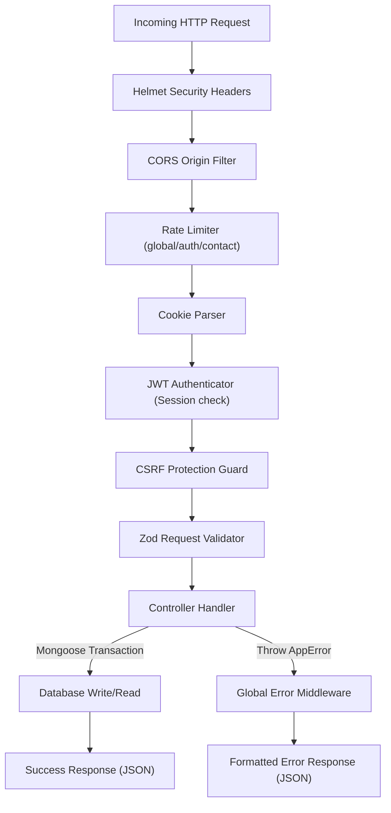
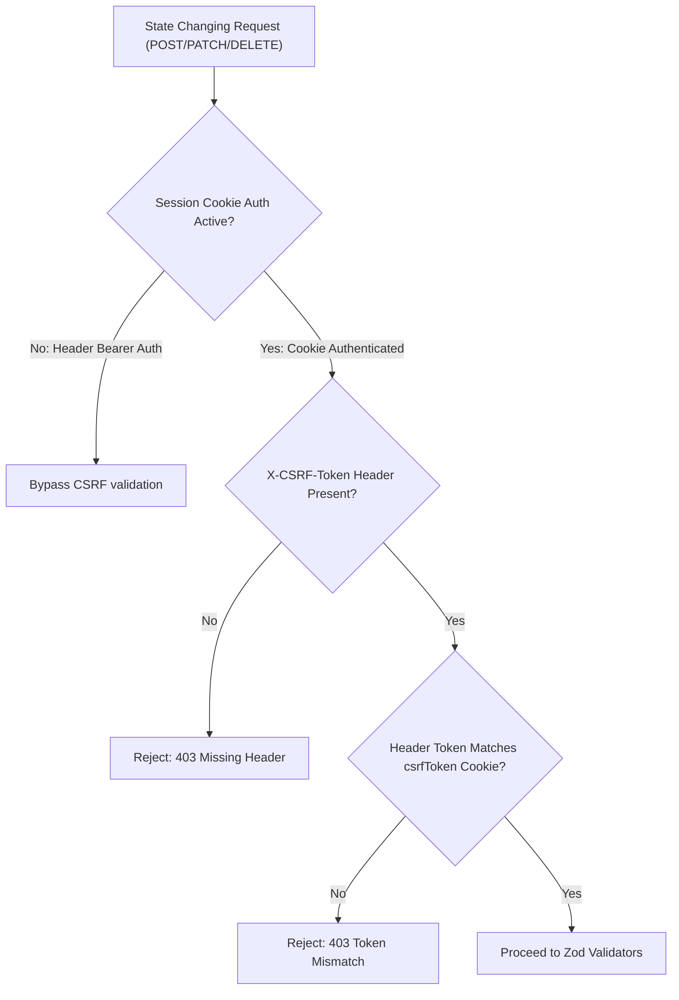

# LUNORA API Request-Response Lifecycle Flow

This document details the middleware pipeline and execution lifecycles for requests reaching the **LUNORA** Express backend API.

---

## ⚙️ 1. Pipeline Execution Order

---

## 🔒 2. Authentication & Authorization Guard

The backend exposes a `protect` middleware which:
1. Resolves token strings from `req.cookies.token` or checks headers for `Bearer <token>`.
2. Verifies the token using `jsonwebtoken` against `JWT_SECRET`.
3. Queries Mongoose `User.findById(decoded.id)`. If the user has changed passwords since issuance, rejects the session.
4. Mounts user metadata to `req.user`.

For administrative endpoints, an `restrictTo("admin")` middleware runs immediately after, verifying `req.user.role === "admin"`.

---

## 🛡️ 3. Double-Submit CSRF Checks Flowchart

