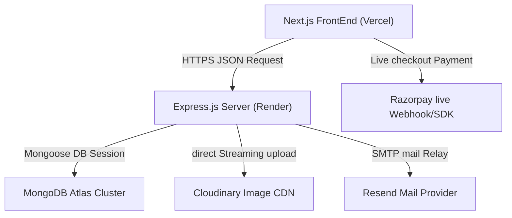
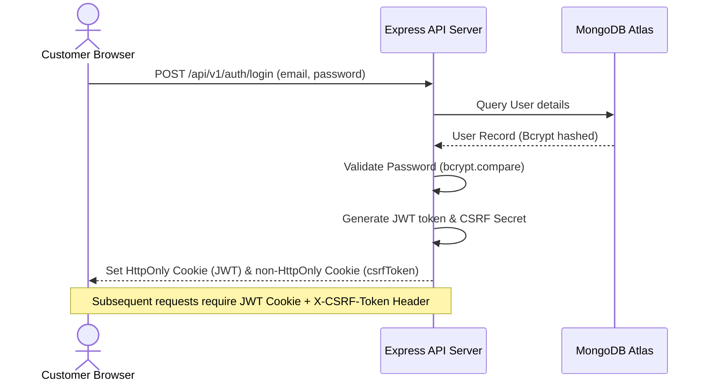
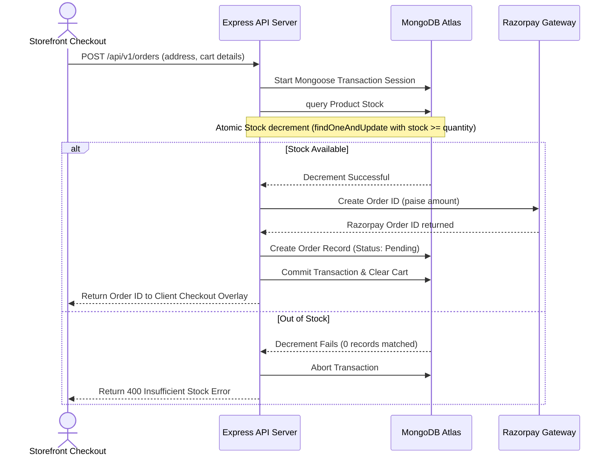
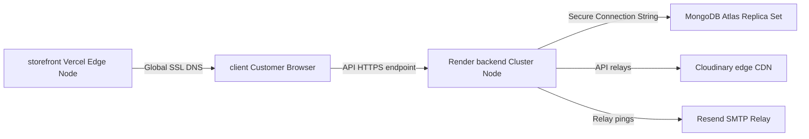

# LUNORA System Architecture

This document describes the architectural blueprints, database relationships, API routing lifecycles, and deployment mapping of the **LUNORA Premium E-Commerce Platform**.

---

## 🗺️ 1. Overall System Architecture

---

## 🔒 2. Authentication & Session Lifecycles

---

## 💳 3. Checkout & Atomic Concurrency Payments

---

## 🗄️ 4. Deployment Topology

