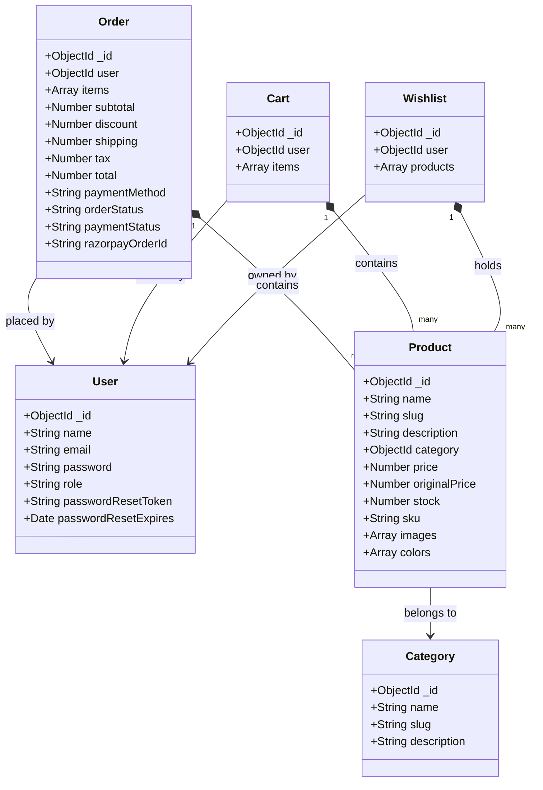

# LUNORA Database Schemas Reference

This document maps all Mongoose models, data schemas, properties, required fields, and index configurations within the **LUNORA** database.

---

## 🗺️ 1. Mongoose Model Relationships

---

## 🗄️ 2. Detailed Collection Fields

### A. Users (`users`)
- `name`: String, required.
- `email`: String, required, unique, indexed.
- `password`: String, required (bcrypt hash).
- `role`: String, enum: `["user", "admin"]`, default: `"user"`.
- `passwordResetToken`: String, indexed (hashed token).
- `passwordResetExpires`: Date.

### B. Products (`products`)
- `name`: String, required, unique.
- `slug`: String, unique, indexed.
- `description`: String, required.
- `shortDescription`: String, required.
- `category`: ObjectId ref `Category`, required, indexed.
- `price`: Number, required, minimum: 0.
- `originalPrice`: Number.
- `stock`: Number, required, minimum: 0, default: 0.
- `sku`: String, unique, indexed.
- `images`: Array of Image Subdocuments:
  - `url`: String, required.
  - `secure_url`: String, required.
  - `publicId`: String, required.
  - `width`: Number, required.
  - `height`: Number, required.
  - `format`: String, required.
  - `bytes`: Number, required.
  - `alt`: String.
  - `isPrimary`: Boolean, default: false.
- `colors`: Array of Color Subdocuments:
  - `name`: String, required.
  - `hex`: String, required.
- `tags`: Array of Strings.
- `rating`: Number, default: 0.0.
- `reviewCount`: Number, default: 0.

### C. Categories (`categories`)
- `name`: String, required, unique.
- `slug`: String, unique, indexed.
- `description`: String, required.

### D. Orders (`orders`)
- `orderNumber`: String, unique, indexed (e.g. `LUN-YYYY-XXXXXX`).
- `user`: ObjectId ref `User`, required, indexed.
- `items`: Array of Order Items:
  - `product`: ObjectId ref `Product`, required.
  - `name`: String, required.
  - `quantity`: Number, required.
  - `price`: Number, required.
  - `color`: Color Subdocument.
- `subtotal`: Number, required.
- `discount`: Number, default: 0.
- `shipping`: Number, required.
- `tax`: Number, required (18% GST).
- `total`: Number, required.
- `shippingAddress`: Object containing name, street, city, state, postalCode, phone.
- `paymentMethod`: String, enum: `["COD", "Razorpay", "UPI", "Card"]`, required.
- `paymentStatus`: String, enum: `["Pending", "Paid", "Failed", "Refunded"]`, default: `"Pending"`.
- `orderStatus`: String, enum: `["Pending", "Processing", "Shipped", "Delivered", "Cancelled"]`, default: `"Pending"`.
- `razorpayOrderId`: String, unique, indexed.
- `razorpayPaymentId`: String.

### E. EmailLogs (`email_logs`)
- `recipient`: String, required.
- `subject`: String, required.
- `bodyTemplate`: String, required.
- `variables`: Object.
- `status`: String, enum: `["sent", "failed", "pending"]`, default: `"pending"`.
- `attempts`: Number, default: 0.
- `errorTrace`: String.
- `provider`: String.
