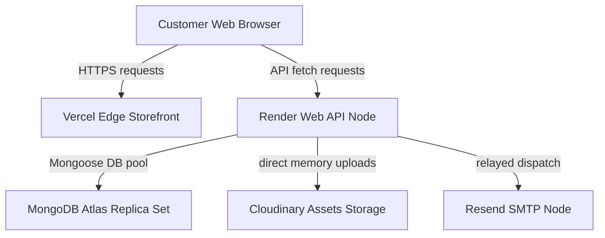

# LUNORA Production Deployment Blueprint

This document details provisioning and deploying LUNORA storefront client on **Vercel** and Express API backend on **Render**.

---

## 🗺️ Staging Architecture Topology

---

## 🚀 1. Provisioning Steps

### A. MongoDB Atlas Database Cluster
1. Register at [MongoDB Atlas](https://cloud.mongodb.com).
2. Choose a cloud provider and regional host closest to your core client base.
3. In **Database Access**, create a user with Read & Write privileges.
4. In **Network Access**, whitelist `0.0.0.0/0` (allowing server host instances to connect dynamically).
5. Copy the connection string SRV URI for environment variables mapping.

### B. Cloudinary Media Asset CDN
1. Register at [Cloudinary](https://cloudinary.com).
2. Retrieve your **Cloud Name**, **API Key**, and **API Secret** from the API console dashboard.

### C. Resend Mail Relays
1. Register at [Resend](https://resend.com).
2. Add and verify your custom DNS domains.
3. Generate a new API Key for SMTP authorization.

### D. Razorpay Payments Live Mode
1. Access the Razorpay account dashboard and switch the toggle to **Live Mode**.
2. Generate API credentials: Key ID (`rzp_live_...`) and Key Secret.

---

## 🎨 2. Hosting Storefront Client (Vercel)
1. Import your GitHub repository to Vercel.
2. Select **Next.js** framework preset.
3. Configure the build commands:
   * Build Command: `npm run build:frontend`
   * Output Directory: `.next`
4. Set Project Environment Variables:
   * `NEXT_PUBLIC_APP_URL` = (e.g. `https://lunora-shop.vercel.app`)
   * `NEXT_PUBLIC_API_URL` = (e.g. `https://lunora-api.onrender.com/api/v1`)
5. Click **Deploy**.

---

## ⚡ 3. Hosting API Server (Render)
1. Create a **New Web Service** on Render.
2. Select root directory `server`.
3. Specify build and start commands:
   * Build Command: `npm install && npm run build`
   * Start Command: `npm run start`
4. Add all production environment variable credentials (refer to `ENVIRONMENT.md` or `live_deployment_playbook.md` template keys).
5. Click **Create Web Service**.
